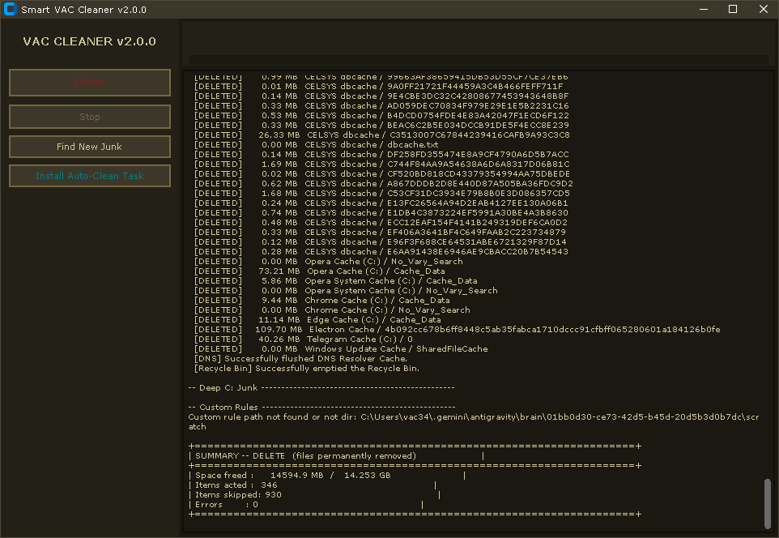

# Smart VAC Cleaner

[English](README.md) · [Русский](README.ru.md) · [Eesti](README.et.md) · [Дед](README.ded.md)



Нормальная чистилка без мусора, портативная. GUI, CLI, планировщик. 

По дефолту — dry-run, пока не впишешь `--delete`. Чекает только те диски, что реально есть, сносит только известную срань. Нет диска — молча идёт дальше, без истерик.

## Че чистим

| Слой | Что именно | Где |
|---|---|---|
| Система | Темпы, дампы, кэш апдейтов винды, DNS, корзина, кэши прог (больше 100 таргетов: браузеры, нода/pip, VS Code, OBS, Дискорд...) | `%TEMP%`, `%LOCALAPPDATA%`, `%APPDATA%` |
| Глубокая срань (C:) | Ошмётки апдейтеров, `*.exe.tmp`, кэш вайбера, бекапы яндекса, логи ODIS | `%LOCALAPPDATA%`, `%TEMP%` |
| Портабельные | Известный мусор внутри твоих папок с портабельным софтом | `portable_roots` в конфиге |
| Свои правила | Твои личные папки + маски файлов | `custom_rules` в конфиге |

## Защита (чтоб не отстрелить ногу)

- **Dry-run по дефолту** — в GUI жмешь "Снести нахер" (спросит подтверждение), в консоли нужен флаг `--delete`.
- **Запретки**: `C:\`, `C:\Windows`, `USERPROFILE`, Program Files, папка самого скрипта — не трогаем вообще.
- **Минимальная глубина**: короткие пути (меньше 5 уровней) шлём лесом.
- **Живые процессы**: если прога сейчас открыта — её кэш не трогаем.
- **Симлинки идут лесом**, `..` тоже.
- **Никогда не сносим**: `login data`, `bookmarks`, `cookies`, `database` и т.д.
- **Исключения**: `exclude_patterns` / `exclude_paths` в конфиге.
- Всё идёт через `SafetyGuard`; ошибки считаем, но не падаем.

## Че надо

- Windows 10/11
- Python 3.10+

## Установка

```bat
python -m venv .venv
.venv\Scripts\activate
pip install -r requirements.txt
```

Или пакетом (появится команда `vac-cleaner`):

```bat
pip install .
vac-cleaner --status
```

Нет питона? Качай `SmartVACCleaner.exe` из [Releases](https://github.com/vacterro/SMART-VAC-CLEANER/releases) — портативная сборка, конфиг и логи будут рядом.

## Собрать exe самому

```bat
powershell -ExecutionPolicy Bypass -File build_exe.ps1
```

Выплюнет `dist\SmartVACCleaner.exe` (PyInstaller). На каждом теге `v*` CI сама собирает exe-шник.

## GUI

```bat
python _SMART_VAC_CLEANER.py
```

Пять кнопок: **Снести нахер** (снесёт реально — сначала спросит), **Тормози**, **Вшить автозапуск**, **В фон** (запустит тихую зачистку без окон) и **Не трогать** (твои исключения). Прогресс-бары, логи. Все запуски пишутся в `logs\clean_*.log`.

## Консоль (CLI)

В консоли **dry-run по дефолту** — просто покажет, сколько говна нашлось.
Добавь `--delete`, если реально хочешь снести. `--dry-run` перебивает `--delete` и заставляет просто показать.

| Флаг | Чё делает |
|---|---|
| `--cli` | Железно консольный режим |
| `--portable` / `--system` / `--custom` | Выбор слоёв (по дефолту просто покажет) |
| `--all` | Все слои разом |
| `--delete` | **УДАЛЯЕТ** (без этого просто покажет) |
| `--dry-run` | Перебивает delete, тупо превью |
| `--status` | Показывает сколько мусора лежит; ничего не удаляет |
| `--analyze-caches` | Ищет кэши в AppData тяжелее 5 МБ |
| `--sys-targets` | Переопределить системные таргеты через запятую |
| `--exclude` | Доп исключения (`--exclude "*.db,*.tmp"`) |
| `--hidden` | Прячет консоль (для планировщика) |
| `--install-task` | Вшивает тихую чистку в планировщик |
| `--time HH:MM` | Во сколько запускать (дефолт `09:00`) |

Примеры:

```bat
REM показать всё
python _SMART_VAC_CLEANER.py --cli --all

REM снести всё
python _SMART_VAC_CLEANER.py --cli --all --delete

REM сунул оба флага - отработает как превью
python _SMART_VAC_CLEANER.py --cli --all --delete --dry-run
```

Глянуть че там скопилось:

```bat
python _SMART_VAC_CLEANER.py --status
```

### Авто-чистка (Планировщик)

```bat
python _SMART_VAC_CLEANER.py --install-task --time 09:00
```

Вшивает задачу `SmartVACCleaner` (высшие права, скрыто). Снести задачу:

```bat
schtasks /Delete /TN SmartVACCleaner /F
```

## Конфиг

`cleaner_config.json` сам создастся рядом со скриптом (или exe) при первом запуске. Все пути нормализуются: слеши, `..`, защитные блеклисты (C:\, Windows, профиль) — всё проверяется. Пример:

```json
{
  "portable_roots": ["D:\\Portable"],
  "custom_rules": [{"path": "D:\\Apps\\TestApp", "pattern": "*.log"}],
  "exclude_patterns": ["*.db"],
  "exclude_paths": ["C:\\Users\\me\\AppData\\Local\\Important"],
  "auto_clean_interval_hours": 0,
  "lang": "en"
}
```

- `portable_roots`: папки, внутри которых ищем мусорные шаблоны (Cache, Temp, Logs). Остальное не трогаем.
- `custom_rules`: `path` (папка) + `pattern` (маска, `*` = всё).
- `exclude_patterns` / `exclude_paths`: что не трогать.
- `lang`: язык — `en` (дефолт), `ru`, `et`, `ded`. Файлики `strings/*.json` лежат рядом (или вшиты в exe). Кинь свой `<lang>.json`, чтоб добавить.

## Тесты

```bat
python -m pytest -q
```

Пашут в офлайне, срут только во временные папки.

## Доки

Все мануалы в [docs/](docs/Home.md): [Safety](docs/Safety.md), [CLI Reference](docs/CLI-Reference.md), [Configuration](docs/Configuration.md), [Build & Install](docs/Build-and-Install.md), [FAQ](docs/FAQ.md).

## Важно

- Для планировщика нужны права админа (`/rl HIGHEST`).
- Портабельные папки на других дисках чистятся и без админа (схема VAC).
- Утилита не от вендоров; пути собраны руками, проги сами их пересоздадут.
<!-- source-digest: README.md sha256:bb86d5bfbdce58a9 -->
